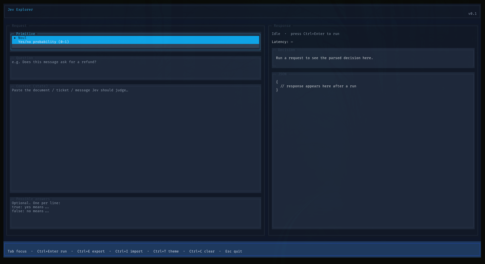

# Jev Explorer



A minimal [OpenTUI](https://opentui.com) terminal UI for [Jev / TypeSafe System One](https://typesafe.ai). Run one question at a time, inspect the raw JSON and API round-trip latency, and save/load cases from `data/`.

## macOS setup

### 1. Install Bun

```bash
curl -fsSL https://bun.sh/install | bash
```

Restart your shell (or `source ~/.zshrc`), then confirm:

```bash
bun --version
```

### 2. Clone / enter the project

```bash
cd /path/to/jev-explorer
```

### 3. Install dependencies

```bash
bun install
```

### 4. Configure your API key

```bash
cp .env.example .env
```

Edit `.env` and set:

```bash
TYPESAFE_API_KEY=your_api_key_here
```

Bun loads `.env` automatically. You can also export the variable in your shell instead.

## Run

```bash
bun start
```

Or:

```bash
bun run src/index.ts
```

## Saving and loading cases

The entire left pane (primitive, question, context, possible answers) can be saved as a JSON case under `data/` and loaded later.

- **Export (`Ctrl+E`)** opens a rename dialog with a suggested filename. Edit it, then press **Enter** to save under `data/` (`.json` is added if missing). **Esc** cancels.
- **Import (`Ctrl+I`)** opens a picker of `data/*.json` files. Use `↑`/`↓`, `Enter` to load, `Esc` to cancel.

Example case shape:

```json
{
  "version": 1,
  "exportedAt": "2026-09-23T12:34:56.789Z",
  "name": "is-this-urgent",
  "form": {
    "primitive": "noul",
    "question": "Is this urgent?",
    "context": "Please help ASAP.",
    "possibleAnswers": ""
  }
}
```

## Develop

```bash
# Typecheck
bun run typecheck

# Unit tests (mocked client — no live API calls)
bun test
```

## Project layout

```
src/
  index.ts      OpenTUI application
  jev.ts        Form validation + TypeSafe SDK call + timing
  cases.ts      Export / import left-pane cases
  themes.ts     Color themes (Slate, Moss, Vineyard, …)
  *.test.ts     Unit + smoke tests
data/           Saved case JSON files (created on export)
.env.example    API key template
```
